# ZeroClone AIGC 智能改写平台

<p align="center">
  
</p>

<h1 align="center">ZeroClone AIGC</h1>

<p align="center">
  多租户 AI 智能改写与 AIGC 降重平台
</p>

<p align="center">
  <a href="https://zeroclone.com"></a>
  <a href="#"></a>
  <a href="#"></a>
</p>


---

## 平台简介

ZeroClone AIGC 是一款专业的多租户 AI 智能改写平台，基于前沿大规模语言模型深度训练，为学术成果和各类文本提供全链路降重解决方案。平台支持多商户入驻，各商户可独立配置品牌主题、套餐策略和运营规则。

### 核心特性

- **AI 智能改写** - 支持文本和文档一键智能改写
- **AIGC 降重** - 有效降低 AIGC 检测率
- **多语言支持** - 中文、英文等多种语言
- **多模型选择** - 多种 AI 改写模型可选
- **多租户架构** - 商户独立运营，品牌自定义

---

## 功能模块

### C 端用户功能

| 功能 | 说明 |
|------|------|
| 智能改写 | 文本/文档 AI 改写，支持多种模型 |
| 套餐购买 | 字数包、时长包在线购买 |
| 卡密兑换 | 支持卡密激活充值 |
| 微信支付 | 扫码支付，快速到账 |
| 推广分销 | 邀请好友赚取佣金 |
| 佣金提现 | 支付宝提现功能 |
| 用户中心 | 余额查询、消费记录 |

### 商户管理后台

| 功能 | 说明 |
|------|------|
| 数据概览 | 改写订单、收入、用户统计 |
| 套餐管理 | 创建/编辑充值套餐 |
| 卡密管理 | 生成/管理兑换卡密 |
| 订单管理 | 改写订单、支付订单查询 |
| 用户管理 | 用户列表、余额管理 |
| 分销配置 | 佣金比例、提现设置 |
| 品牌设置 | LOGO、名称、主题配置 |
| 支付配置 | 微信支付参数设置 |

---

## 技术架构

### 前端技术栈

- **React 18** - UI 框架
- **React Router** - 路由管理
- **Ant Design** - 组件库
- **Tailwind CSS** - 样式方案
- **Zustand** - 状态管理
- **Vite** - 构建工具

### 后端技术栈

- **Spring Boot** - Java Web 框架
- **Spring Security** - 安全框架
- **MyBatis Plus** - ORM 框架
- **MySQL** - 数据库
- **Redis** - 缓存
- **JWT** - 认证授权

---

## 项目结构

```
zerocloneAI/
├── zeroclone/              # C端用户前端应用
│   ├── src/
│   │   ├── api/            # API 接口
│   │   ├── components/     # 公共组件
│   │   ├── hooks/          # 自定义 Hooks
│   │   ├── pages/          # 页面组件
│   │   ├── store/          # 状态管理
│   │   └── themes/         # 主题配置
│   └── package.json
│
├── tenant-ui/              # 商户管理后台
│   └── src/                # 商户前端应用

```

---

# ZeroClone截图

### 用户界面
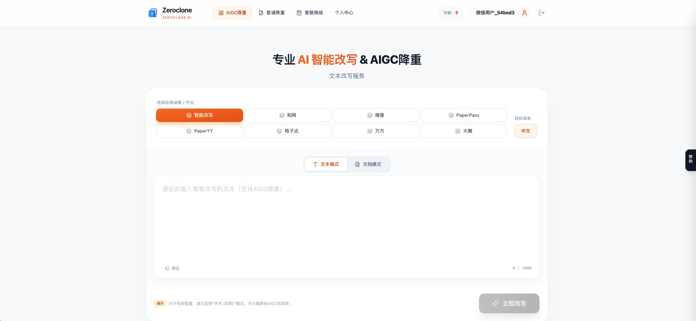
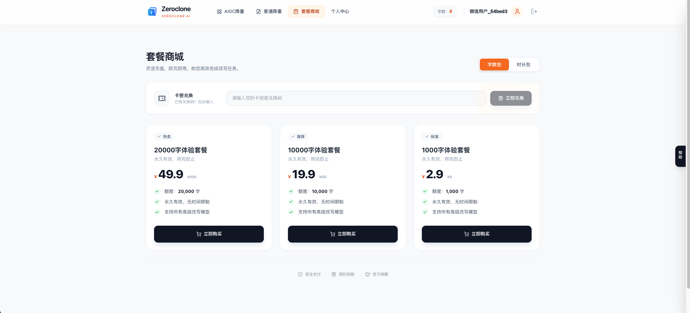
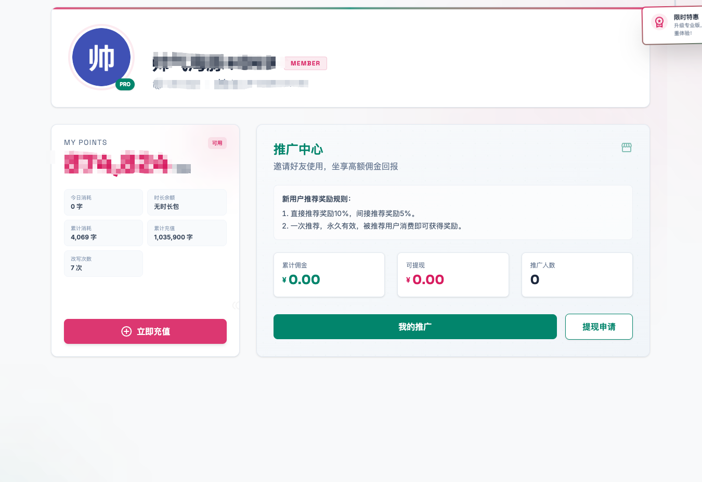

### 管理端后台
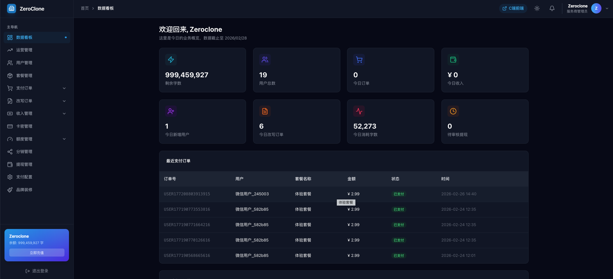

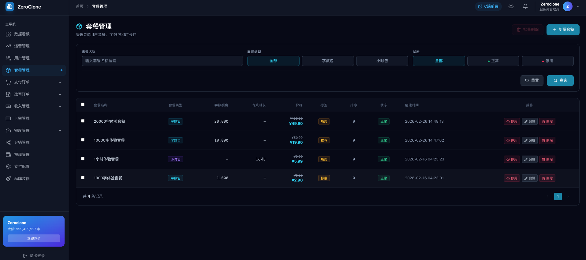
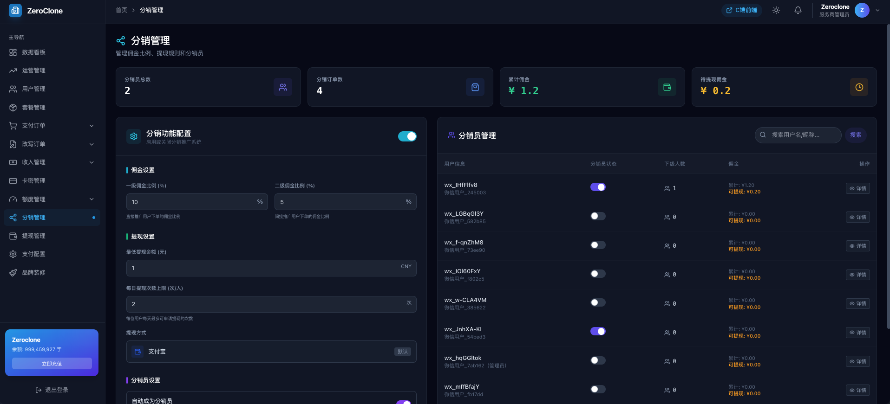
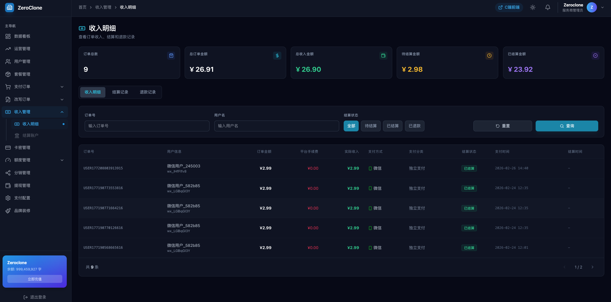

### 降重效果
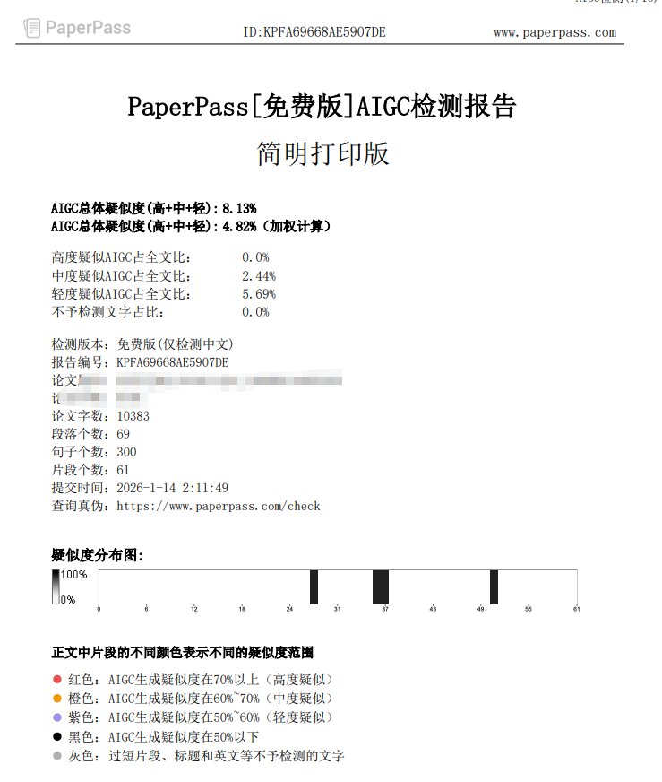
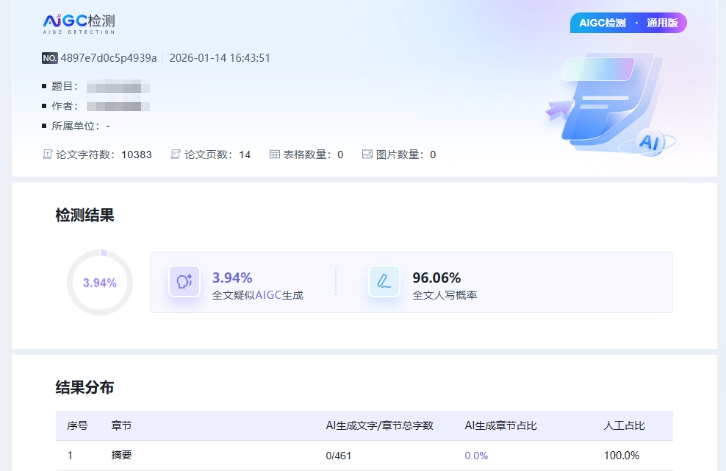
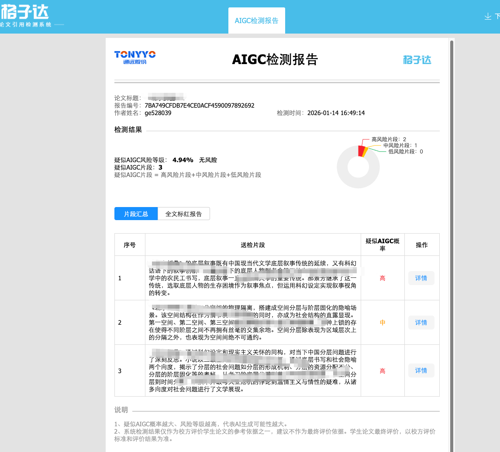
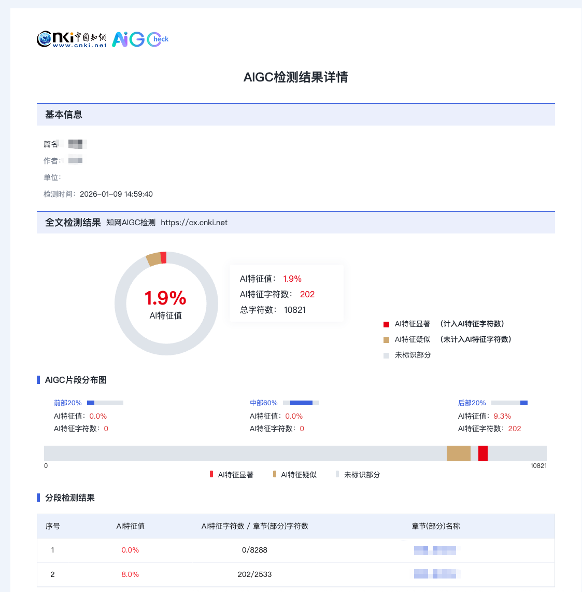

---

## 官方网站

- 官网地址：[https://zeroclone.com](https://zeroclone.com)

---

## 许可证

MIT License

---

## 联系方式

<p align="center">
  
</p>

- 联系商户支持 API 或 OEM 对接
